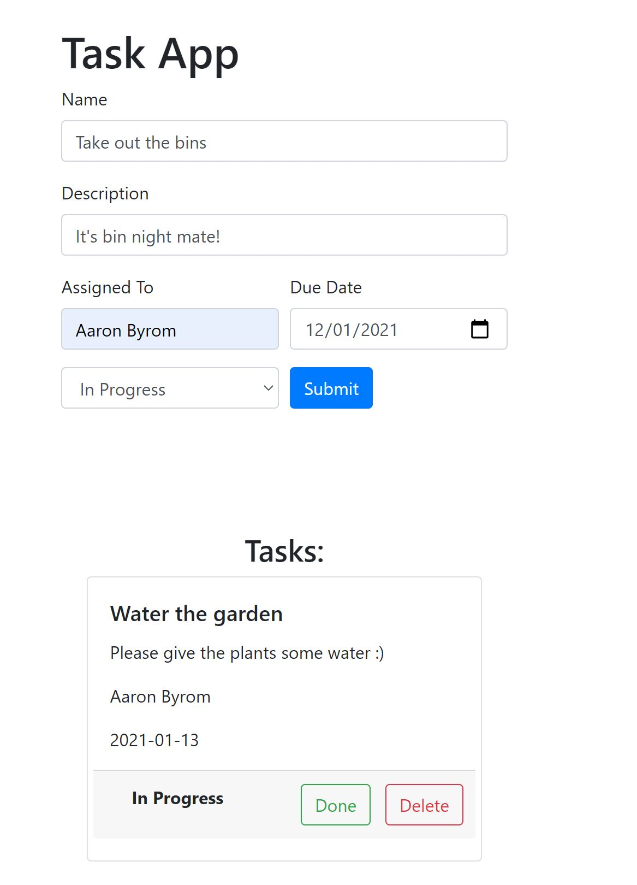

# Jr Web Developer Final Project - Task Planner Web App

### General Objectives

* Create a Task Planner web app from scratch.
* Demonstrate the technical and non-technical skills developed during the Junior Web Developer program. 

### Details

* You will work in **groups of 2-3 people** as assigned by the instructor. 
* This project has **10 tasks** (~3 hours each) divided into **3 Sprints**.
* Each Sprint will have a sprint **retrospective** in your Sprint Closing session at the end following the Scrum methodology.
* At the end of the project, you and your group will do a **final project presentation** to the entire class.

### Assessment criteria

Refer to the [rubric](https://docs.google.com/spreadsheets/d/1D_X3AEE_niIYFq0oeebpRGADUsnej6wcjICl9RWUsF0/edit?usp=sharing) to see how the assessment will be marked and what is required for each task.

### Example

[Check out a live example](https://final-project-jwd.netlify.app/)

